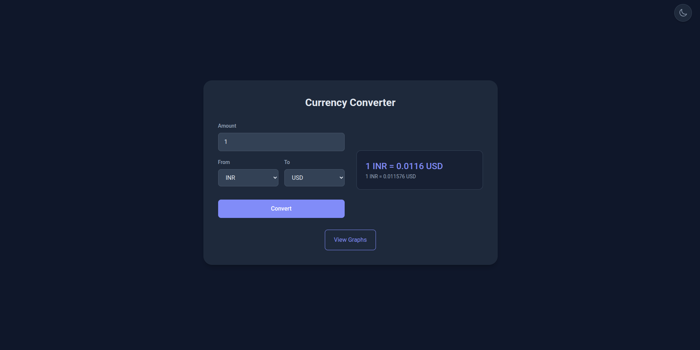
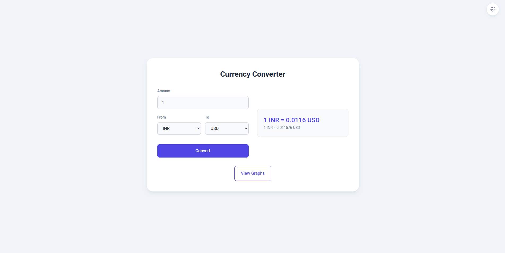
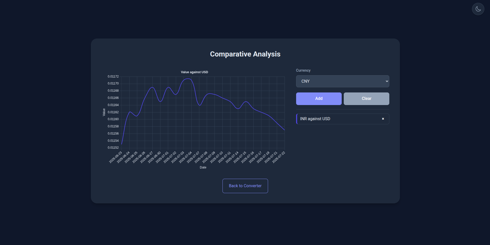

A currency analysis tool built with Django and modern front-end technologies. This application provides real-time currency conversion and interactive historical data visualization in a clean, responsive, and user-friendly interface.

#### **Preview images of the project**
Currency converter:




---
## Features
-   **Live Currency Conversion:** Get up-to-the-minute exchange rates using the ExchangeRate-API.
-   **Interactive Historical Graph:** Plot and compare the 30-day performance of multiple currencies against a base currency (USD or EUR).
-   **Dynamic UI:**
    -   A seamless, single-page application experience with smooth scrolling between sections.
    -   Interactive graph legend: hover over a currency to highlight its line on the chart.
    -   Add and remove currencies from the comparison graph individually.
-   **Dark/Light Mode:** A beautiful, persistent dark mode theme with a toggle for a light theme.
-   **Robust & Secure Backend:**
    -   API keys and secrets are kept secure using environment variables.
    -   Backend caching for historical data to minimize redundant API calls.
-   **Polished UX:**
    -   Animated UI elements for a modern feel.
    -   Input validation to prevent errors.
    -   Auto-focus on the amount field for immediate use.

Past 30 days performance graph of a currency:


---
## Tech Stack
-   **Backend:** Django, Python
-   **Frontend:** HTML, CSS, JavaScript
-   **Charting:** Chart.js
-   **APIs:**
    -   [ExchangeRate-API](https://www.exchangerate-api.com/) (for live conversion)
    -   [Frankfurter.app](https://www.frankfurter.app/) (for historical data)
-   **Libraries:** `requests`, `python-decouple`

---
## Project Setup and Installation
Follow these steps to get the project running on your local machine.
### 1. Prerequisites
-   Python 3.8 or higher
-   `pip` package manager
-   Git
### 2. Clone the Repository
```bash
git clone https://github.com/vk2git/currency-converter.git
cd currency-converter
````
### 3. Set up a Virtual Environment
It is highly recommended to use a virtual environment to manage project dependencies.
```
# For Windows
python -m venv venv
venv\Scripts\activate

# For macOS/Linux
python3 -m venv venv
source venv/bin/activate
```
### 4. Install Dependencies
The `requirements.txt` file contains all the necessary Python packages.
```
pip install -r requirements.txt
```
### 5. Set Up Environment Variables (Crucial Step)
This project uses a `.env` file to manage secret keys, for security reasons the file is empty. You need an API key and a Django secret key to get started. Follow the below instructions.
- **Get your API :** Sign up for a free API key at [ExchangeRate-API.com](https://www.exchangerate-api.com/ "null").
- **Generate a Django Secret Key:** You can use an online generator or run the following Python command:
	```
	python -c 'from django.core.management.utils import get_random_secret_key; print(get_random_secret_key())'
	```
- **Fill in your `.env` file** with your new keys. It should look like this:
    ```
    SECRET_KEY='your_newly_generated_django_secret_key'
    API_KEY='your_api_key_from_exchangerate-api.com'
    ```
### 6. Fetch Currency List
Run the custom management command to create the local `currencies.json` file. This is required for the converter's dropdowns to work.
```
python manage.py fetch_currencies
```
### 7. Run the Django Server
Apply the database migrations and start the development server.

```
python manage.py migrate
python manage.py runserver
```

The application should now be running at `http://127.0.0.1:8000/`.
